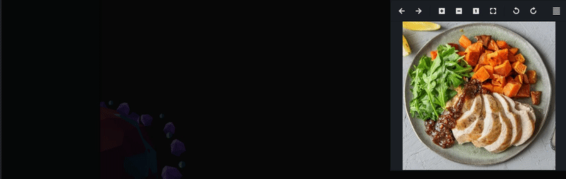

# Meal Expense Bot

## Table of contents
* [Overview](#overview)
* [Examples](#examples)
* [Technologies](#technologies)
* [Setup](#setup)
* [Limitations](#limitations)

## Overview
### Synopsis
Ever wonder just how fancy that food really is? The Meal Expense Bot will try to guess how much the raw ingredients cost! The Meal Expense Bot simply does not care how fancy your food is. The bot will determine what ingredients are in the meal and will assign a price to each ingredient.

### Extended
The bot uses machine learning image recognition to determine what ingredients may be in a given image. Once the ingredients are determined, they are sent through the Spoonacular API. The API will then attempt to determine the prices of one serving of each ingredient. By tallying up all the estimated costs for each suspected ingredient, a total price for the raw ingredients can be determined.

## Examples

> Meal Expense Bot determining the price of the meal to the right!

## Technologies
- **Python 3.8**
- **OpenCV 4.3.0**
- **Tensorflow 2.3**
- **ImageAI 2.15**

## Setup

### Spoonacular API

You need to get an API key from [Spoonacular](https://spoonacular.com/food-api).  
Once you have an API key, you must enter it into where it says *"your-api-key-here"* in the `settings.json` file.  

### Requirements

The required packages must be installed:

    pip3 install -r requirements.txt

## Usage

- Add an image of a meal to the `./images/` folder.  
- To get the program to reference your image, change *Photo_Reference* in the `settings.json` file to reference the name of your meal image.
Run the program:  

    python3 recognize.py

## Limitations
- Objects in the image are not always left out
  - Sometimes ingredients are overlooked
  - Sometimes ingredients are thought to be in the image that aren't
- [ ] Multiple object detection not implemented

## License
Licensed under the [GNU General Public License v3.0](LICENSE).
